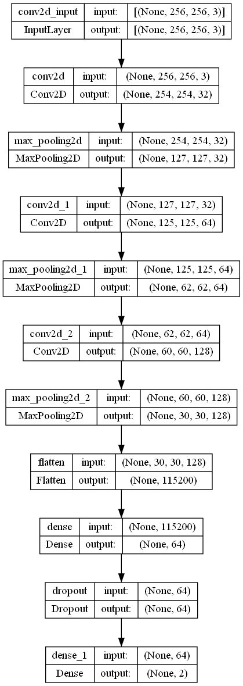

# Fall Detection using CNN (Convolutional Neural Network)

## Overview

This repository contains the code and resources for fall detection using Convolutional Neural Networks (CNN). The goal of this project is to develop a deep learning model that can accurately detect falls from video or image data. The CNN architecture is well-suited for image-based tasks and has been successful in various computer vision applications, including fall detection.

## Table of Contents

1. [Introduction](#introduction)
2. [Installation](#installation)
3. [Dataset](#dataset)
4. [Usage](#usage)
5. [Model Training](#training)
6. [Model Testing](#testing)


## Introduction

Falls are common among older adults and can lead to severe injuries. Automatic fall detection systems are crucial for providing timely assistance and reducing the risk of adverse consequences. Convolutional Neural Networks have shown promising results in various image-based tasks, making them an excellent choice for fall detection from video frames or images.

# Convolutional Neural Network (CNN)

## What is a CNN?

A Convolutional Neural Network (CNN) is a type of deep learning architecture specifically designed for image and visual data processing tasks. CNNs are highly effective in tasks such as image classification, object detection, segmentation, and more. They are inspired by the visual processing mechanism in the human brain and have shown remarkable success in various computer vision applications.

## CNN Architecture

A typical CNN architecture consists of several layers that work together to learn and extract features from images. The primary layers in a CNN include:

### 1. Convolutional Layers

Convolutional layers are the core building blocks of a CNN. These layers apply convolution operations to the input image using learnable filters (also known as kernels). The convolution operation involves sliding the filters over the input image, computing element-wise multiplications, and summing the results to produce feature maps. These feature maps capture different patterns, textures, and structures present in the input image.

### 2. Activation Functions

After each convolutional layer, an activation function is applied element-wise to the feature maps. The most commonly used activation function is the Rectified Linear Unit (ReLU), which introduces non-linearity into the network and allows it to learn more complex features.

### 3. Pooling Layers

Pooling layers are used to reduce the spatial dimensions of the feature maps while retaining the most important information. Max-pooling is a widely used pooling technique, which selects the maximum value from a small region of the feature map and discards the rest. Pooling helps in reducing the computational complexity and controlling overfitting.

### 4. Fully Connected Layers

After several convolutional and pooling layers, the feature maps are flattened and passed through one or more fully connected layers. These layers serve as classifiers and are typically used for tasks like image classification, where the network needs to assign a label to the input image.

### 5. Output Layer

The output layer of the CNN generates the final predictions based on the task. For example, in image classification, the output layer may have neurons representing different classes, and the class with the highest activation indicates the predicted label.

**Our CNN architecture is as follows:**<br>

</img>
## Advantages of CNN

CNNs offer several advantages in image processing tasks:

- **Hierarchical Feature Learning:** CNNs can automatically learn hierarchical features from low-level to high-level representations, making them well-suited for complex visual tasks.

- **Translation Invariance:** Convolutional layers share weights, allowing the network to detect features regardless of their location in the input image.

- **Reduced Parameters:** CNNs use weight sharing and pooling, resulting in fewer parameters compared to fully connected networks, which makes them computationally efficient.

- **Spatial Hierarchies:** Pooling layers create spatial hierarchies, enabling the network to capture patterns at different scales.

For more in-depth knowledge about CNNs, consider exploring research papers and tutorials in the field of computer vision and deep learning.


## Installation

To use this project, you need to set up a Python environment and install the required dependencies. Here's how you can do it:

1. Clone the repository:

```bash
git clone https://github.com/yourusername/fall-detection-cnn.git
cd fall-detection-cnn
```
## Dataset

The availability of a labeled fall detection dataset is essential for training and evaluating the CNN model. If you already have a fall detection dataset, ensure that it includes two classes: "fall" and "non-fall" samples. Each sample should consist of images or video frames labeled with the corresponding class.<br>

The dataset used for this project is: <a href = "https://www.kaggle.com/datasets/uttejkumarkandagatla/fall-detection-dataset"> Dataset</a><br>

If you want to explore other fall detection dataset, you can explore publicly available datasets or create your own by capturing video frames of falls and non-fall activities.
## Usage

Before running any scripts, make sure you have prepared your fall detection dataset as described in the [Dataset](#dataset) section.

## Training

To train the CNN model on your fall detection dataset, you need to execute the training section <a href="./fall_detection.ipynb">`fall_detection.ipynb`</a> notebook file. You can customize the training parameters, such as batch size, learning rate, and number of epochs, in the script.

## Testing

To check the outout run the `detect_video_fall.py` using

```
python detect_video_fall.py
```
Make sure to replace the `model_path` and `custom_video_path` with your own video and model in order to test it